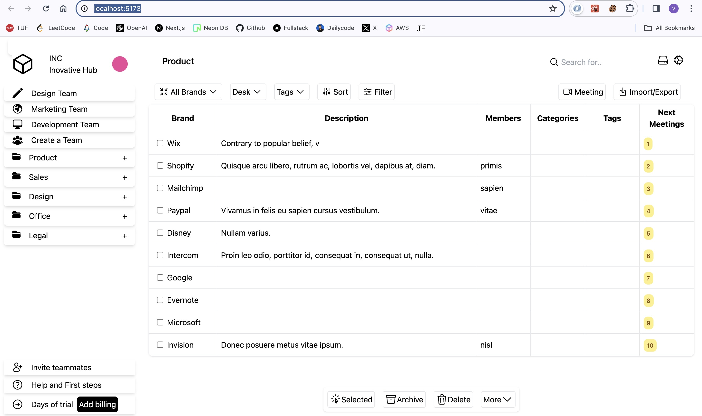
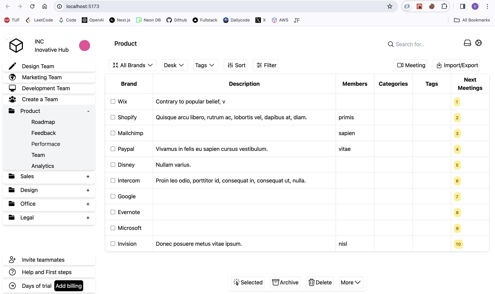
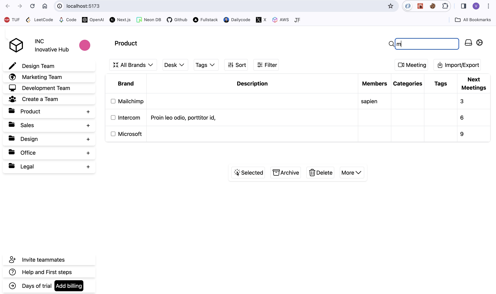
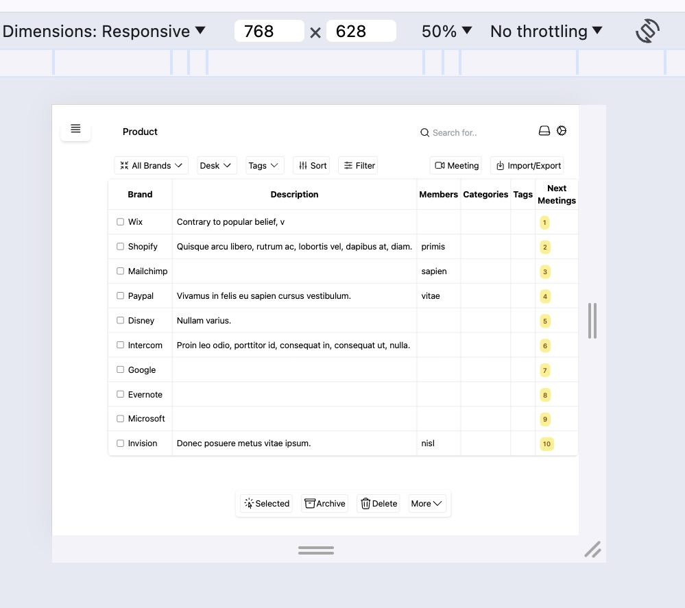

# React + Vite Project

To run the project ->
git clone <--http repo link-->
npm i  
npm run dev

# Tech stack

Frontend - React , Tailwind css , Heroicons
State management - Recoil

# Task :

# Final Look

# DropDown

Make the menu items clickable, and upon click, display a simple dropdown menu
or transition to another page.
-> Click on product it show drop down menu.
-> Note : no navigation but can be added using react-router-dom.

# Filter feature

Implement a search functionality that filters the list of items displayed based on
user input
-> Search option search the result based on brand name.
example -- search microsoft -- table will show result for that particular brand.

Add hover effects to interactive elements to enhance user experience.
-> Buttons on hover change their bg color to slight gray

# Responsive

Web page is responsive -> however I have used single layout only.
